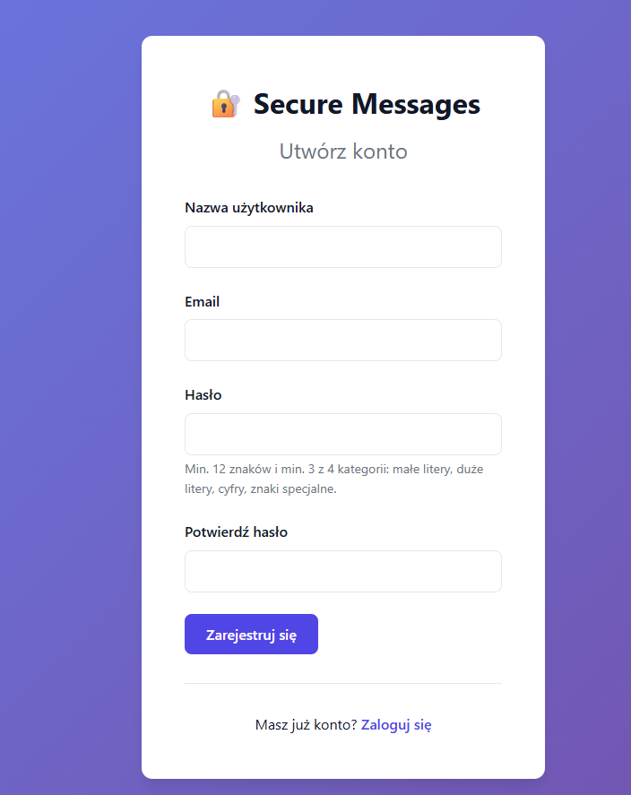
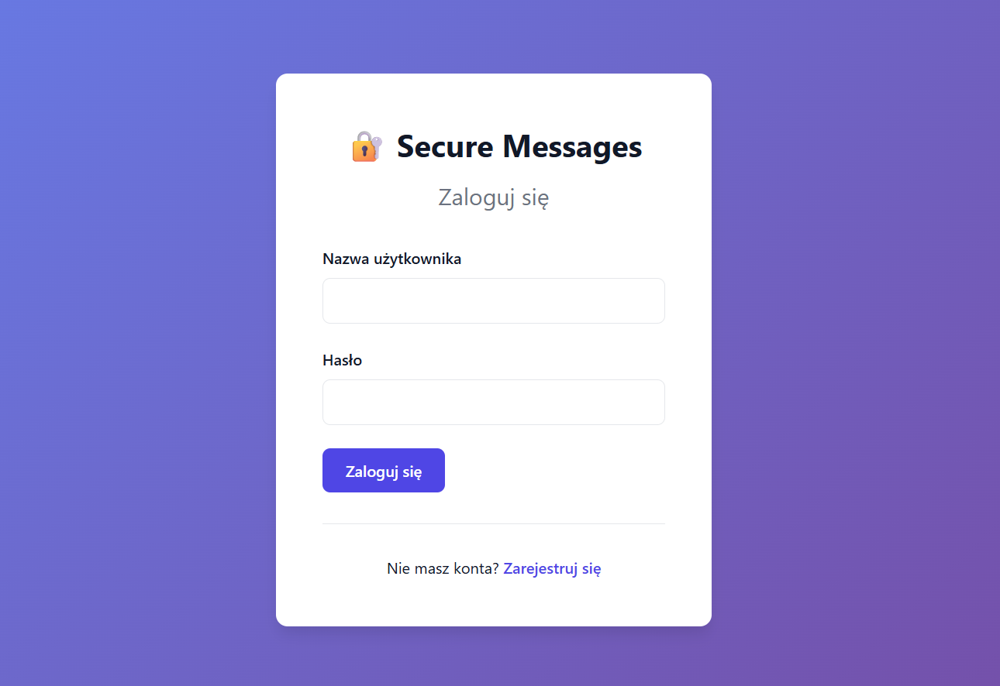
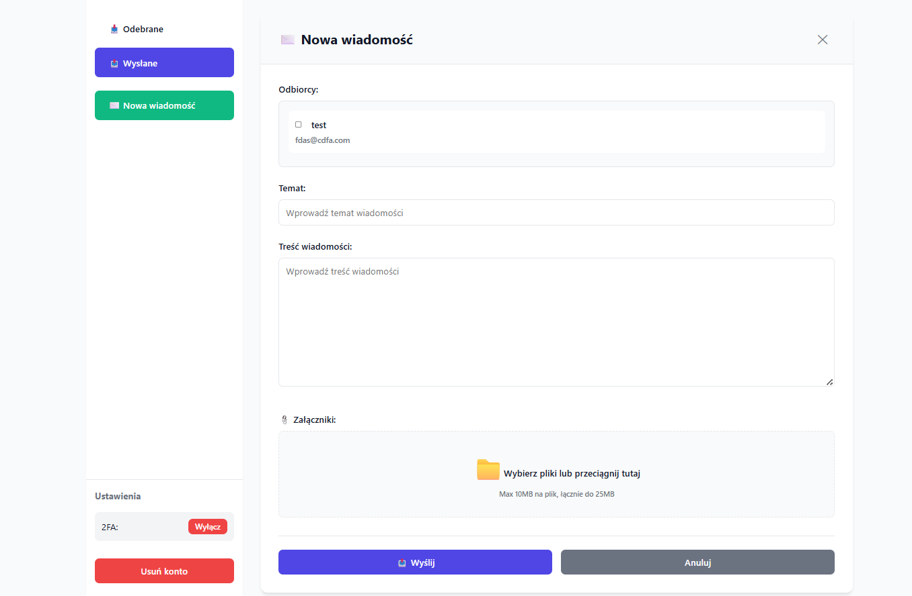
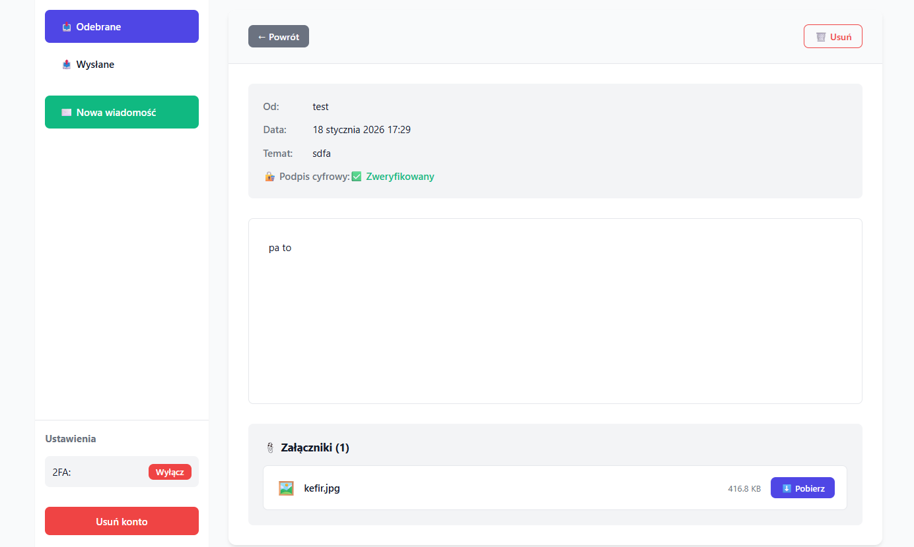
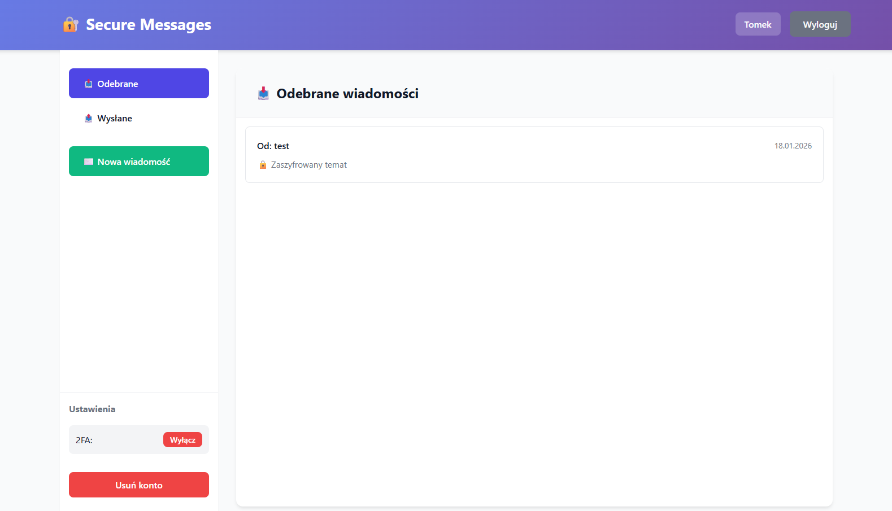

## 🚀 Uruchomienie projektu

### Kroki:

```bash
# 1. Sklonuj repozytorium
git clone https://github.com/twoj-username/messages.git
cd messages

# 2. Skopiuj plik konfiguracyjny
cp .env.example .env

# 3. (Opcjonalnie) Edytuj .env i zmień hasła

# 4. Wygeneruj certyfikaty SSL
chmod +x generate-certs.sh
./generate-certs.sh

# 5. Uruchom aplikację
docker-compose up --build

# 6. Otwórz https://localhost w przeglądarce
#    (zaakceptuj ostrzeżenie o certyfikacie)
```

### Domyślne dane logowania do bazy:

- Host: `localhost:5432`
- Baza: `messagesDB`
- User: `admin`
- Password: `admin`

(można zmienić w pliku `.env`)

---

## 🔐 Security & Encryption (E2EE)

Poniżej krótki opis mechanizmów kryptograficznych użytych w projekcie, przepływów rejestracji, logowania, wysyłania i odbioru wiadomości oraz najważniejsze uwagi bezpieczeństwa.

### 🎯 Główne algorytmy i parametry

- Hasła / derywacja: **PBKDF2WithHmacSHA256**, 100000 iteracji, klucz 256-bit, sól 32B (Base64).
- Szyfrowanie treści: **AES-256-GCM**, IV = 12 bajtów, tag = 128 bitów.
- Asymetria: **RSA 2048** z OAEP (SHA-256) do szyfrowania kluczy AES.
- Podpisy: **SHA256withRSA** (RSASSA-PKCS1-v1_5 + SHA-256).
- 2FA: **TOTP** (SHA-1, 6 cyfr, okres 30s).

### 🧾 Rejestracja (wysokopoziomowo)

1. Walidacja siły hasła (reguły w kodzie).
2. Generowana sól i hash hasła (PBKDF2), oba zapisywane w DB.
3. Generowana para RSA (public/private).
4. Prywatny klucz RSA szyfrowany AES-256-GCM, gdzie AES-key jest derywowany z hasła (PBKDF2 z osobną solą `keyDerivationSalt`). W DB przechowujemy `encryptedPrivateKey = ciphertextBase64:ivBase64` oraz `keyDerivationSalt`.
5. Generowany secret TOTP (użytkownik może go aktywować).



### 🔑 Logowanie

1. Serwer weryfikuje hash hasła (PBKDF2 + sól).
2. Jeśli TOTP włączone — dodatkowa weryfikacja kodu.
3. Po uwierzytelnieniu serwer zwraca klientowi (m.in.): `publicKey`, `encryptedPrivateKey`, `keyDerivationSalt` (odszyfrowanie klucza prywatnego wykonuje klient po wpisaniu hasła).



### ✉️ Wysyłanie wiadomości (E2EE)

- Nadawca generuje losowy AES-256 i IV.
- `subject` i `content` szyfrowane AES-GCM tym kluczem i IV.
- Załączniki: zawartość pliku, nazwa i mime-type szyfrowane tym samym AES/IV.
- AES-key eksportowany do raw bytes i dla każdego odbiorcy szyfrowany RSA-OAEP (kluczem publicznym odbiorcy). Dla nadawcy jest też kopia zaszyfrowanego klucza (self-copy).
- Nadawca tworzy hash wiadomości (SHA-256 z base64(subjectEncrypted)+base64(contentEncrypted)) i podpisuje go kluczem prywatnym (SHA256withRSA). Podpis wysyłany na serwer.
- Serwer przechowuje jedynie zaszyfrowane blob-y i metadane — nie odszyfrowuje treści.



### 📥 Odbieranie i odczyt

- Klient pobiera `encryptedAesKey` przypisany do odbiorcy i odszyfrowuje go prywatnym kluczem RSA (RSA-OAEP) — otrzymuje raw AES key.
- Importuje AES key i odszyfrowuje subject/content/załączniki używając IV.
- Weryfikuje podpis wiadomości za pomocą publicznego klucza nadawcy i odtworzonego hasha.



### ✅ Co jest szyfrowane / co nie

- ZASZYFROWANE: temat, treść, załączniki (zawartość, nazwa, mime), AES key (dla każdego odbiorcy), prywatny klucz użytkownika (w DB).
- NIE zaszyfrowane: publiczne klucze (PEM), metadane typu sender/recipient ids, timestamps, rozmiary plików.



### ⚠️ Dalsze możliwości rozwoju

- Możliwośc edycji profilu użytkownika
- Wyszukiwanie odbiorców, zamiast wybierania z listy
- Lepsza walidacja hasła
- Oddzielenie produkcji od developmentu

---
